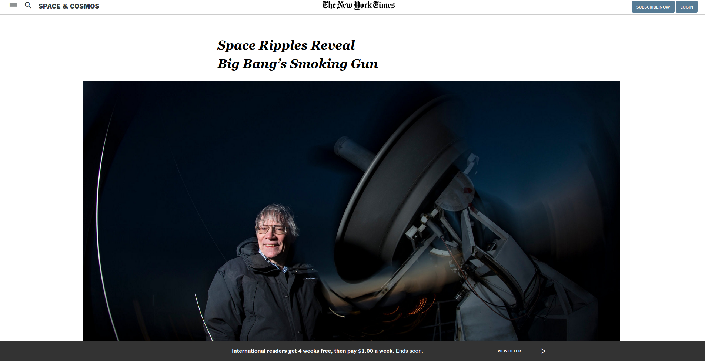

# Positioning and Floating Elements 
##  Building an HTML document that matches the appearance of New York Times page as part of Microverse program.

### Built With
    html
    css (floats and media queries)

### Check it online!
[Live preview](https://phfdonda.github.io/new-york-times-clone/)

### Authors:
##### Felipe dos Anjos
GitHub: [@fc-anjos](https://github.com/fc-anjos)  
Linkedin: [@fc-anjos](https://www.linkedin.com/in/felipe-cavalheiro-dos-anjos-4792a8176/)

##### Pedro Donda
Github: [@phfdonda](https://github.com/phfdonda) 
Twitter: [@phfdonda](https://twitter.com/phfdonda)
Linkedin: [@phfdonda](https://www.linkedin.com/in/pedro-donda-808621bb/)

### Contributions and issues are welcome!

### License
This project is MIT licensed.
